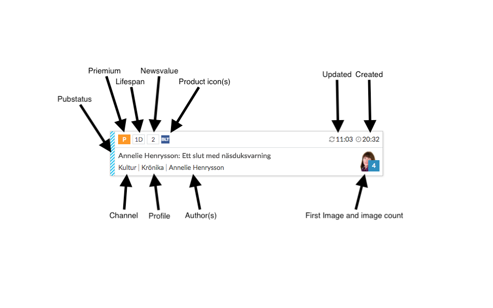
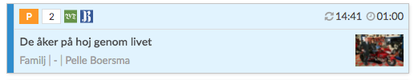

# Content relations plugin

This plugin uses a `Editorial Ba-proxy` to search Editorial OC backend for articles. From the search result, the
user can drag and drop the related article onto the open article.

## Dependency

- This plugin requires `writer > 3.13.0` and depends on the `writer.UIPagination` class.
- This plugin requires a contentHost (editorial ba-proxy) which is used for Open Content search requests towards the editorial Open Content, and needs configuration under contentHost (see below)

## Tab placement
The tab under which the plugin will be rendered can be specified with the:

- `"tab": "xxx"` field, above the data section, you can specify in which tab the plugin should run, if this field is left out, it will render in a new tab

```json
{
    "id": "se.infomaker.contentrelations",
    "name": "contentrelations",
    "url": "xx.../im-contentrelations.js",
    "style": "xx.../im-contentrelations.css",
    "enabled": true,
    "mandatory": false,
    "tab": "main", <---
```

## Plugin configuration

- `"defaultSorting": "Updated"` name of the OC sorting to be used as default sorting
- `"npDropLinkMatcher":` On drop, If a match is found params is updated with `isNpDroplink=true`
- `"contentHost": {... ` BA-proxy config
- `"credentials": "include",` and `"mode": "cors",` indicates the usage of a ba-proxy using IMID, if not, those props should be omitted
- `"contenttype": "Article",` Article contentType in OC
- `"locale": "sv",` Locale used to print dates
- `"defaultQueries": [ ` populate the query-dropdown with queries
- `"icons": [... ` icons to use in results list, article.product (specified in propertyMap) will look for `icon.name`

```json
{
    "id": "se.infomaker.contentrelations",
    "name": "contentrelations",
    "url": "http://localhost:5001/im-contentrelations.js",
    "style": "http://localhost:5001/im-contentrelations.css",
    "enabled": true,
    "mandatory": false,
    "data": {
        "defaultSorting": "Updated",
        "npDropLinkMatcher": "http://127.0.0.1:8080/opencontent[^\\s]+",
        "contentHost": {

            "credentials": "include",
            "mode": "cors",

            "protocol": "https://",
            "hostName": "baproxy.dev.gota.infomaker.io",
            "port": "5555",
            "healthPath": "/health",
            "queryPath": "/search",
            "objectPath": "/objects",
            "sortingsPath": "/sortings"
        },
        "contenttype": "Article",
        "locale": "sv",
        "defaultQueries": [
            {
                "label": "Fritext",
                "q": ""
            },
            {
                "label": "Artilkar med bilder",
                "q": "ImageUuid:*"
            },
            {
                "label": "Webartiklar",
                "q": "ArticleType:Webbartikel"
            }
        ],
        "propertyMap": {
            ... (see documentation below)
        },
        "icons": [
            {"name": "bot", "data": "data:image/svg+xml;base64,xxx"},
            {"name": "blt", "data": "data:image/svg+xml;base64,xxx"},
            {"name": "bt", "data": "data:image/svg+xml;base64,xxx"},
            {"name": "kb", "data": "data:image/svg+xml;base64,xxx"},
            {"name": "smp", "data": "data:image/svg+xml;base64,xxx"},
            ...
        ]
    }
},
```

#### Property map

The property map is used to translate different kind of OC configurations into prop names that the plugin can use.
The left hand side will be used by plugin, fill in the property-names from OC on the right hand side.

- All properties on the left side needs to be defined, the right hand side can how ever be set to an empty string (`""`) if the property is not in use.

```json
"propertyMap": {
    "uuid": "uuid",
    "headline": "WriterHeadlines",
    "authors": "WriterAuthors",

    "images": "ArticleMetaImageUuids",

    "created": "created",
    "updated": "updated",
    "published": "Pubdate",
    "pubstatus": "PubStatus",

    "premium": "ArticleMetaPremium",
    "lifetime": "ArticleMetaLifeTime",
    "newsvalue": "ArticleMetaNewsValue",

    "channels": "ArticleMetaChannels",
    "sections": "ArticleMetaServices",
    "profiles": "ArticleMetaProfile",

    "hasPublishedVersion": "WriterHasPublishedVersion"
},
```

### Property usage

Image below explains how and where the different props are displayed.



Article with `WriterHasPublishedVersion=true` will be displayed with a blue background color



## Output

In the article, the plugin will add the following xml block under `newsItem > contentSet > inlineXML > idf > group`
(e.g. article):

```xml
<object id="contentrelations-e17ef7b21393e2b1dac1c1fbd7ffc597" uuid="e390944b-08cf-426a-b4bd-ea0b9b28a4dc" title="Test article" type="x-im/link">
    <links>
        <link rel="self" type="x-im/article" uuid="e390944b-08cf-426a-b4bd-ea0b9b28a4dc"/>
    </links>
</object>
```

Example of related image:

```xml
<object id="MzcsMjUyLDExMiwyNDY" type="x-im/image" uuid="1f220bbc-87fc-5b73-ab1a-c474ab71d026">
    <links>
        <link rel="self" type="x-im/image" uri="im://image/Rn0GMaBFK7oJyCTdAhcc0-TmZcI.jpg" uuid="1f220bbc-87fc-5b73-ab1a-c474ab71d026">
            <data>
                <width>800</width>
                <height>563</height>
                <text/>
                <credit/>
            </data>
            <links>
                <link rel="author" uuid="00000000-0000-0000-0000-000000000000" title="Photographer: Jean-Jacques Serol" type="x-im/author"/>
                <link rel="author" uuid="00000000-0000-0000-0000-000000000000" title="Photographer: Jean-Jacques Serol/Pepite Photography" type="x-im/author"/>
            </links>
        </link>
    </links>
</object>
```
