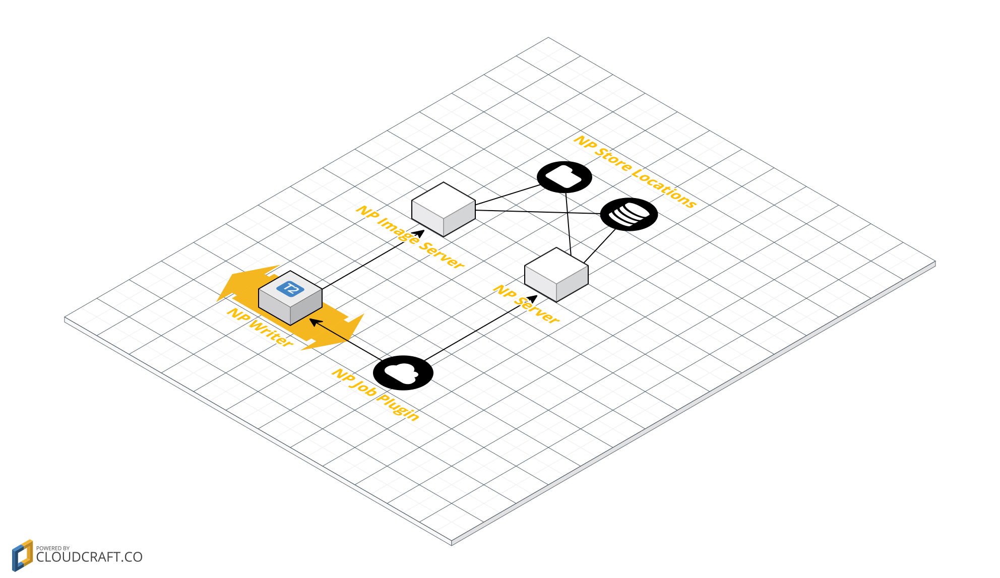

# Job plugin for Newspilot
Supports list/dnd of images in Newspilot Job to which article belongs. 

Note that in order for plugin to actually get images to render the article needs to be linked to
Newspilot article, i.e. article has been created in Newspilot. 

## Architecture


NP Job Plugin fetches information of images in newspilot for linked newspilot article using socket api calls
to Newspilot Server. 

When user drags an image from plugin onto article the "main" or ordinary route for uploading images
via URL drop in Newspilot Writer is executed. The NP Job Plugin have constructed an URL that points
to NP Image Server that can handle images in Newspilot regardless of store location (i.e. if 
image is stored in database or on volume).

## Operations information
If Newspilot (and Newspilot image Server) is not in the same network (i.e. AWS ), Newspilot Writer 
needs to be whitelisted in Newspilot network (to allow Newspilot Writer download images) and NP
Job Plugin obviously need access to Newspilot Server API to extract information regarding article
in Newspilot.

Preview and thumb are rendered using Writer server as proxy to access NP Image Server.

## Plugin configuration
```json
{
  "id": "se.infomaker.newspilot.job",
  "name": "npjob",
  "url": "https://plugins.writer.infomaker.io/releases/{PLUGIN_VERSION}/im-newspilot-job.js",
  "style": "https://plugins.writer.infomaker.io/releases/{PLUGIN_VERSION}/im-newspilot-job.css",
  "enabled": false,
  "mandatory": false,
  "data": {
    "imageProxyServer": "https://image.proxy.host",
    "newspilotHostName": "newspilot.host",
    "externalSystemId" : 12,
    "storeLocationConfig": {
      "111": {
        "type": "editorial-opencontent"
      }
    }
  }
}
```
`imageProxyServer` corresponds to NP Image Server in image above.

`externalSystemId` should be the ID of the external system which the writer is connected to.

`storeLocationConfig` Contains the IDs of store locations which should be threated differently.

### Supported Store location config types

#### editorial-opencontent
```json
    "storeLocationConfig": {
      "111": {
        "type": "editorial-opencontent"
      }
```
If the store location (in this case with id `111`) is of type S3 and connected to Editorial Open content, the link will be constructed as `x-im-entity://x-im/image`. 
This link will then be picked up by the ximimage-plugin.

## Output
An image that has been dragged and dropped onto the article will generate the same output as `se.infomaker.ximimage` 
plugin.

Note that plugin require **https** when communicating with Newspilot API.


