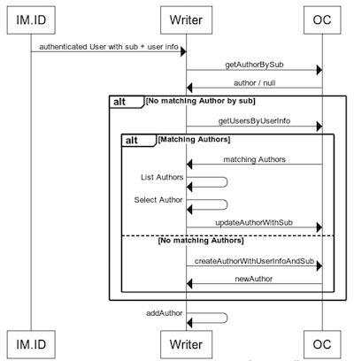

# Infomaker IM.ID user byline plugin

A plugin that handles IM.ID user byline implementation for traceability. Will by default set current user as author on new articles.

If there ias no match for IMID sub on any author concept a search for authors with the same email will be made.

When an author is selected from suggestion list, it will also set IM.ID sub on connected author concept.

<!-- Initial plan, not implemented yet. Will not create a new concept -->
<!--  -->

## Dependencies

> requires `writer >= 5.0.0`

> requires `ConceptAuthorFirstname`, `ConceptAuthorLastname`, `ConceptAuthorEmail` and `ConceptImIdSubjectId` in open content.

## Configuration

The following config is used in the plugin config:

- `"supportEmail": "conceptadmin@myorg.com"` Optional email to display when user does not match any existing author concept.
- `"optional": true` If 

```json
{
    "id": "se.infomaker.user-byline",
    "name": "im-user-byline",
    "url": "http://localhost:5001/im-user-byline.js",
    "style": "http://localhost:5001/im-user-byline.css",
    "mandatory": false,
    "enabled": true,
    "data": {
        "supportEmail": "tim.schill@infomaker.se",
        "optional": true
    }
}
```

## Open Content

Editorial Open content needs to be updated with a few new Indexfields and Properties. Those are described and specified in `editorial/writer/writer-user-configuration.yml` in [Open Content Configs repository](https://bitbucket.org/infomaker/opencontent-configs/src/master/)

## Writer config

The following properties needs to be added to the `ConceptService` part of the writer config:

```json
"propertyMap": {
    ...
    "ConceptAuthorFirstname": "ConceptAuthorFirstname",
    "ConceptAuthorLastname": "ConceptAuthorLastname",
    "ConceptAuthorEmail": "ConceptAuthorEmail",
    "ConceptImIdSubjectId": "ConceptImIdSubjectId",
    ...
}
```
